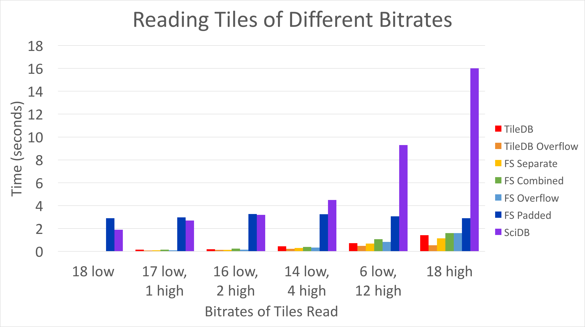
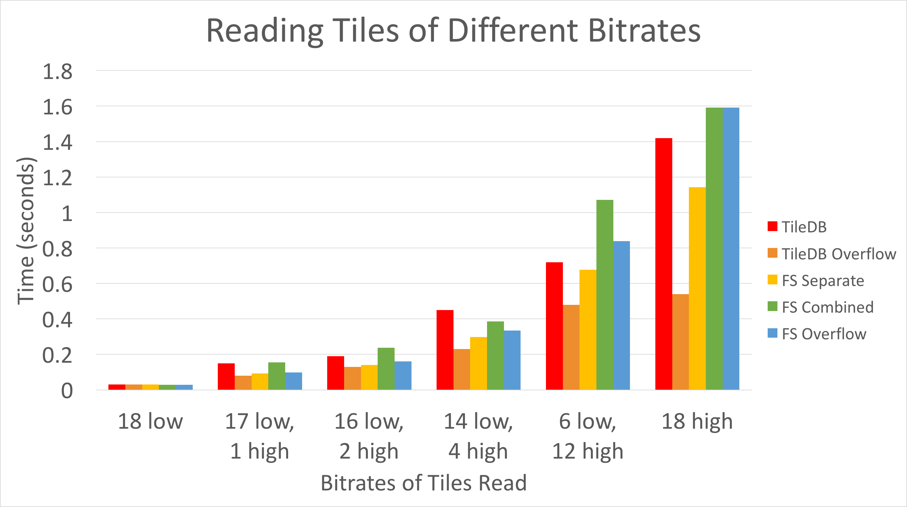
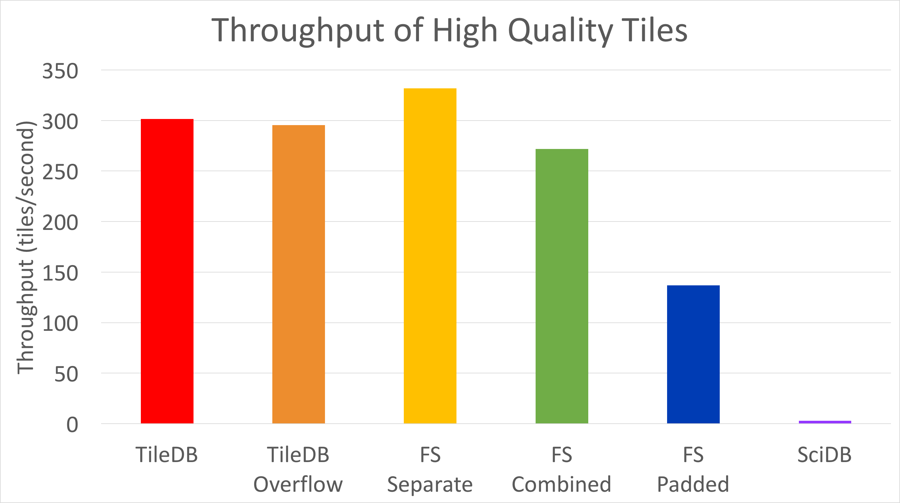

# Array-Based Database System Performance for Virtual Reality Video Storage
#### Brandon Haynes & Jessica Schroeder

Recent advances in virtual reality (VR) has prompted the development of new applications ranging from gaming and entertainment to education and scientific visualization.  Spherical panoramic VR videos (a.k.a. *360 videos*) has become increasingly popular in many of these applications.  360 videos allow the user to view a spherical video scene from any angle.  Such videos allow for a truly immersive experience, as they allow the user to observe the scene as they would observe their surroundings in their everyday life.

However, applications requiring 360 videos produce a need for rapid data streaming and storage at volumes far exceeding those found in 2D videos.  Supporting such high volumes of data requires maximum efficiency to provide the user with a seamless, high-quality portrayal of the created scene. 

In this article, we compare data storage and retrieval performance using TileDB, SciDB, and the file system to determine which strategy provides the fastest storage and retrieval for video segments.

## Video Data

We decomposed each video used in the experiments into uniformally-sized segments, as is done in the [VisualCloud DBMS](http://visualcloud.cs.washington.edu).  We then temporally decomposed each segment into 20-second *tiles*.  Each tile is treated as an opaque binary value when read from or written to the target database system.

**We elected to leave the tiles as HEVC-encoded video, since the size of the unencoded video is Each  experiments on HEVC-encoded video, as the size of the unencoded video is up to 250%+ larger than its encoded counterpart.  An alternate format is HEVC-encoded video MPEG-4 pre-muxed as DASH-compatible fragments, which would allow us to use the initialization segment as an index and potentially improving query performance.  However, investigating that experiment was beyond the scope of this project.**

## Systems Overview
We investigated data storage and retrieval on the file system, as well as two array-based database management systems: [SciDB](http://www.paradigm4.com/try_scidb/) and [TileDB](http://istc-bigdata.org/tiledb/).  We chose to focus on array-based database systems because they allow easy storage and retrieval of particular dimensions and ranges.  Their query languages are also well-suited to the workload needed to process video data for VR applications (e.g., streaming video by time and point queries for augmented reality).

### File System
By far the easiest system to use to store and retrieve video data is the file system.  Reading and writing binary files is relatively easy using simple C scripts, so if the file system had been comparable to the database systems, it would have been the clear choice in terms of ease of use.

As illustrated below, we adopted four strategies for our file system baseline:

* Storing each tile in a separate file,
* Length-prefixing and concatenating tiles in one file for each quality,
* Storing small tiles (<10mb) in length-prefixed concatenated form, with larger tiles (>=10mb) stored in separate files, and
* Padding each tile to uniform length and concatenating them (by quality) in each file 

### SciDB
SciDB was the first array-based database management system we tested.  In their [paper](http://doi.org/10.1007/978-3-642-22351-8_1), the authors describe their main motivation for SciDB as designing a system for the data management needs of scientists.  Specifically, many scientists (especially those working with astronomy or genetics data) often have multiple petabytes of data they need to store and process.  They also need to be able to perform complex analytics of those data, which requires open-sourced data so they can add any necessary missing features.

SciDB employs a shared-nothing architecture that consists of a coordinator node and worker nodes.  Chunks of data are automatically distributed across worker nodes.  The system can be queried using an imperative array functional language (AFL).  These features, which were developed to support the large amount of array-based data that scientists often work with, are also potentially useful for managing 360 video data.

### TileDB
TileDB is a new array-based database management system that is currently used by the Intel Health and Life Sciences Group to process genomic data.  Papadopoulos et al. developed TileDB to be optimized for both dense and sparse arrays.  It focuses on super fast storage and retrieval of array-based data.  In their [paper](https://doi.org/10.14778/3025111.3025117), they compare the performance of loading and updating data in TileDB to that of SciDB, and conclude that TileDB is faster for both dense and sparse arrays.

## Experiments
To compare the performance of all three of our systems, we wrote scripts to read from and write to the file system (in C), TileDB (in C), and SciDB (in AFL).  We averaged the performance over at least 5 repetitions for each system, clearing the file cache between experiments to minimize any confounding factors associated with the operating system.  

We examined TileDB both using its default storage method ('TileDB' in our graphs below) and one using overflow pages, where we modified the DBMS to use external files for large binary values (>10mb) and inserted pointers to these files inside TileDB ('TileDB Overflow').  

As described, for the file system we investigated reading files when each tile is a separate file ('FS Separate'); reading files where the individual tiles were combined into a single file, separated by integer representations of the size of each file ('FS Combined'); reading files where the entire file containing all tiles at 50 megabits per second was read, along with random tiles at 9000 megabits per second ('FS Overflow'); and reading files where individual tiles were combined into a single file and padded to be equivalent sizes ('FS Padded').  

SciDB does not have an option for overflow pages, so we used it with its normal chunking method ('SciDB').  Because of the large size of each tile, we used a chunking size of 1; values higher than this caused out-of-memory errors.

The experiments we performed were: 

1. Reading tiles of different bitrates
2. Writing tiles of different bitrates 
3. Throughput of 9mbps tiles

## Results
Overall, TileDB with overflow pages seems to be the most efficient method for storage of 360 video data, but the file system is more efficient in terms of writing and throughput of tiles.  We detail the results of our three experiments below.

### Experiment 1:
The first experiment was looking at reading tiles of different bitrates.  For the graphs below, the y axis corresponds to the time in seconds, and the x axis corresponds to the number of files at each of two bitrates (50kbps and 9mbps).

As you can see, SciDB and the file system with the padded file were the least efficient for reading tiles by far.  We therefore eliminated those results to view the rest of the systems:

Here, we can see that TileDB using overflow pages seems to perform the best for all combinations of bitrates.  TileDB on its own, performed comparatively poorly, likely because video files are larger than its configured to handle.  The file system did best when each tile was stored separately, though that was still slower than TileDB using overflow pages.  Interestingly, the file system combined method, where specific tiles were read from single files, performed less well than the file system overflow method, where the entire set of tiles at 50 kilobits per second were read along with random single files at 9 megabits per second.  The time it took to scan through the file and only read the relevant tiles therefore exceeded the time it took to just read the entire file, for the 50kbps tiles.

### Experiment 2:
Next, we looked at writing tiles of different bitrates using our different systems.  Again, for the graphs below, the y axis corresponds to the time in seconds, and the x axis corresponds to the number of files at each of two bitrates (50kbps and 9mbps).

Again SciDB totally dominates the write times, especially for larger bitrates.  We again eliminated those results to view the other systems:

When it comes to writing video tiles, the file system seems to be the fastest at all tile sizes we tested. TileDB using overflow pages again significantly outperforms TileDB without them, but was still less efficient than the file system.

### Experiment 3:
Finally, we looked at the throughput of the 9mbps tiles.  Here, the y axis is the throughput in tiles per second.

The file system had the highest throughput when reading tiles stored in individual files.  TileDB with overflow pages again outperformed TileDB without them, and both were more significant than the other methods involving the file system.  SciDB had the lowest throughput by far.

## Conclusions 
We found that SciDB is less efficient by far than either TileDB or the file system, so should likely not be used for storing and retrieving data.  TileDB using overflow pages was consistently more efficient than TileDB without them, but the file system outperformed TileDB in general in terms of both writing and throughput. 

One thing to keep in mind is that we could have further optimized the file system read tests; had we done so, we probably would have matched TileDB in terms of efficiency.  However, doing so would have required much more time, to the point that TileDB would then likely be the better choice in terms of usability. 

Overall, both TileDB using overflow pages and the file system seem to be reasonable choices for storing and retrieving 360 video data.